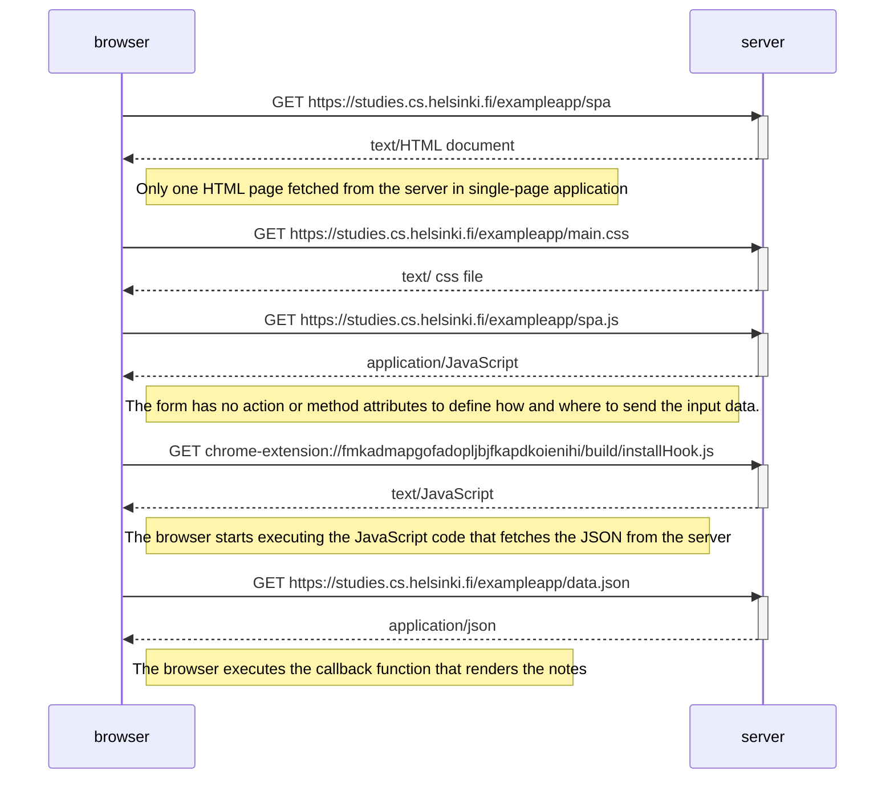

```mermaid
sequenceDiagram
participant browser
participant server

    browser->>server: GET https://studies.cs.helsinki.fi/exampleapp/spa
    activate server
    server-->>browser: text/HTML document
    deactivate server

    Note right of browser: Only one HTML page fetched from the server in single-page application

    browser->>server: GET https://studies.cs.helsinki.fi/exampleapp/main.css
    activate server
    server-->>browser: text/ css file
    deactivate server

    browser->>server: GET https://studies.cs.helsinki.fi/exampleapp/spa.js
    activate server
    server-->>browser: application/JavaScript
    deactivate server

    Note right of browser: The form has no action or method attributes to define how and where to send the input data.

    browser->>server: GET 	chrome-extension://fmkadmapgofadopljbjfkapdkoienihi/build/installHook.js
    activate server
    server-->>browser: text/JavaScript
    deactivate server

    Note right of browser: The browser starts executing the JavaScript code that fetches the JSON from the server

    browser->>server: GET https://studies.cs.helsinki.fi/exampleapp/data.json
    activate server
    server-->>browser: application/json
    deactivate server

    Note right of browser: The browser executes the callback function that renders the notes
```
