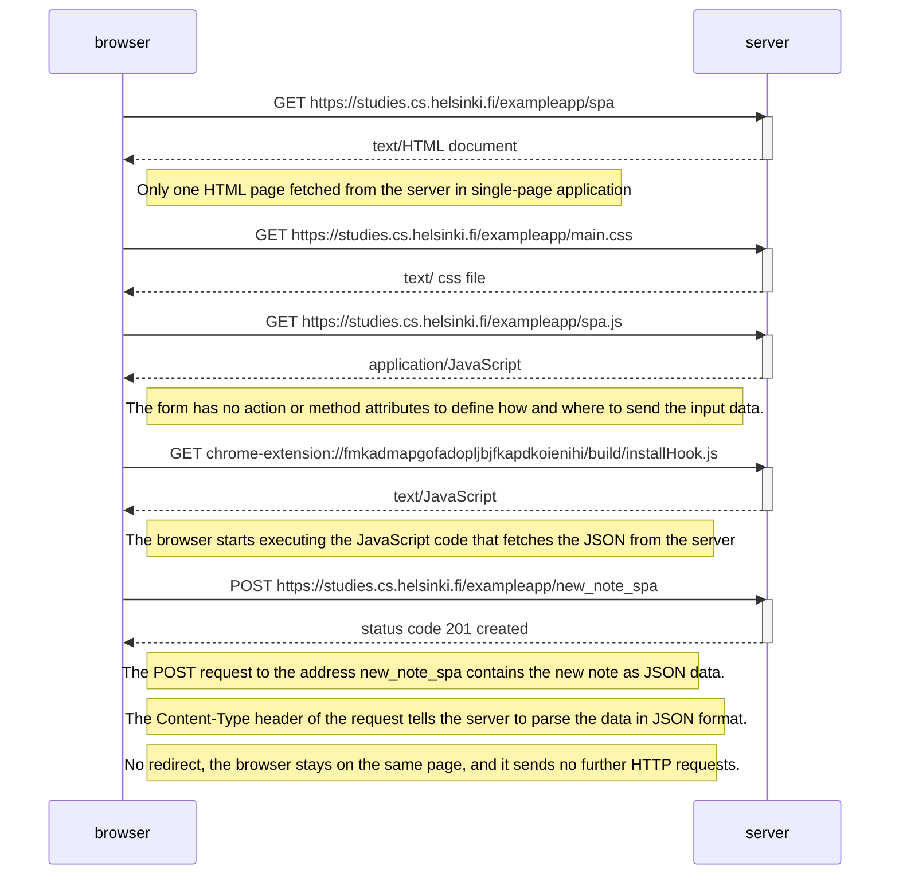

```mermaid
sequenceDiagram
participant browser
participant server

    browser->>server: GET https://studies.cs.helsinki.fi/exampleapp/spa
    activate server
    server-->>browser: text/HTML document
    deactivate server

    Note right of browser: Only one HTML page fetched from the server in single-page application

    browser->>server: GET https://studies.cs.helsinki.fi/exampleapp/main.css
    activate server
    server-->>browser: text/ css file
    deactivate server

    browser->>server: GET https://studies.cs.helsinki.fi/exampleapp/spa.js
    activate server
    server-->>browser: application/JavaScript
    deactivate server

    Note right of browser: The form has no action or method attributes to define how and where to send the input data.

    browser->>server: GET 	chrome-extension://fmkadmapgofadopljbjfkapdkoienihi/build/installHook.js
    activate server
    server-->>browser: text/JavaScript
    deactivate server

    Note right of browser: The browser starts executing the JavaScript code that fetches the JSON from the server

    browser->>server: POST https://studies.cs.helsinki.fi/exampleapp/new_note_spa
    activate server
    server-->>browser: status code 201 created
    deactivate server

    Note right of browser: The POST request to the address new_note_spa contains the new note as JSON data.
    Note right of browser: The Content-Type header of the request tells the server to parse the data in JSON format.
    Note right of browser: No redirect, the browser stays on the same page, and it sends no further HTTP requests.
```
