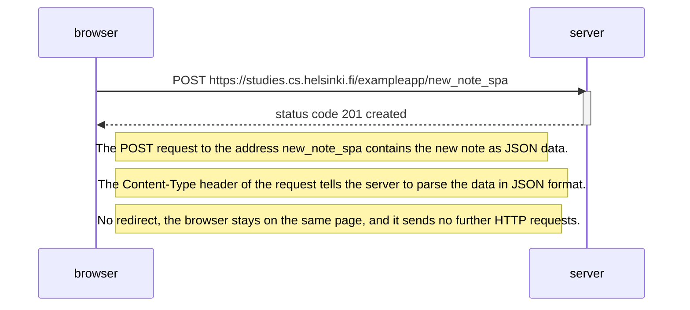

```mermaid
sequenceDiagram
    participant browser
    participant server

    browser->>server: POST https://studies.cs.helsinki.fi/exampleapp/new_note_spa
    activate server
    server-->>browser: status code 201 created
    deactivate server

    Note right of browser: The POST request to the address new_note_spa contains the new note as JSON data.
    Note right of browser: The Content-Type header of the request tells the server to parse the data in JSON format.
    Note right of browser: No redirect, the browser stays on the same page, and it sends no further HTTP requests.
```
